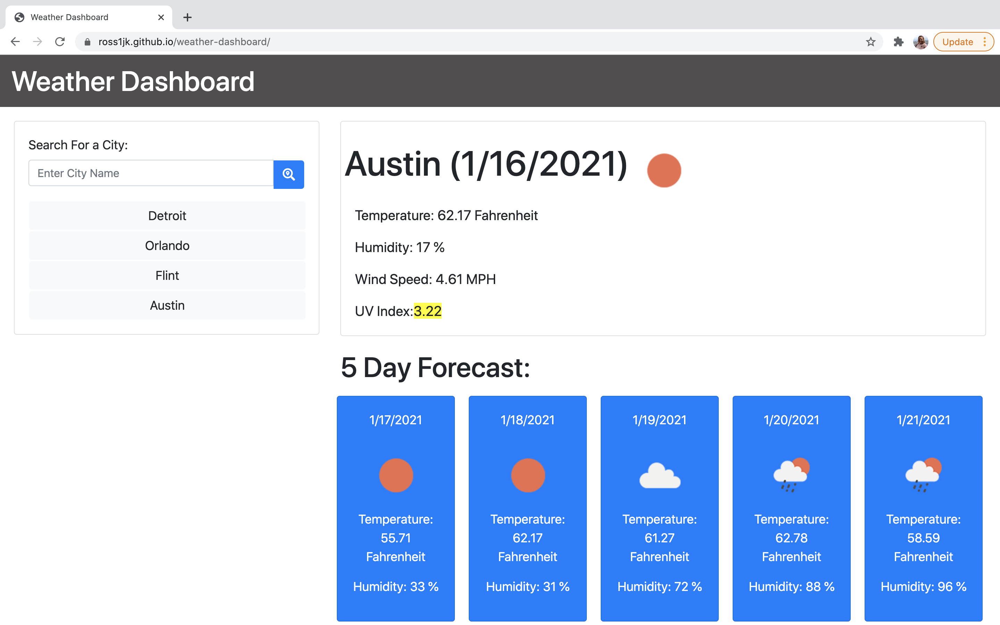

# Weather Dashboard

This weather dashboard was designed to meet the following user story:

```
AS A traveler
I WANT to see the weather outlook for multiple cities
SO THAT I can plan a trip accordingly
```
## Description

This weather dashboard features dynamically updated HTML and CSS. [OpenWeather API](https://openweathermap.org/api) is used to retrieve weather data cities and your Local Storage will will store any cities that you search. 

While utilising this application you will be able to:
Search for a city through the use of a form or by selecting an item from your search history, you will be presented with current and future conditions for that city and that city will be added to your the search history. 

When you view the current weather conditions for a given city you will be presented with the city name, the date, an icon representation of weather conditions, the temperature, the humidity, the wind speed, and the UV index. The UV index will change color to indicate whether the conditions are favorable, moderate, or severe. 

Future weather conditions are also available for viewing. You are presented with a 5-day forecast that displays the date, an icon representation of weather conditions, the temperature, and the humidity.

Once the the weather dashboard is open you will be presented with the last searched city forecast. 


## Pre-deployment Notes 

Please note, the buttons must be double clicked in order to render the weather information on the page. 

Please alo see my special notes for consdieration for code. 

## Deployed Application

Access the deployed application at: 

https://ross1jk.github.io/weather-dashboard/

## Mock-Up

The following image shows the application’s basic functionality:



# Weather Dashboard Code Breakdown 

## Special Notes for Consideration 

### UV Index API 

Will be depreciated in April. However, when using open call api, The only value that would appear for the UV index was 0. 0 is inaccurate. This will need to be updated once the one call api provides an accurate read for the API index. 

### Moment.Js Code 

Will also be depreciated for the format that is being utilized. Will need to be looked at a later date. 

## Folder Structure

To follow industry best practices within the Secure Password Generator repository the folder structure has been updated.

**index.html** Stands on it own, outside of any folder. This html file was created by me and contains my html code. 

**README.md** Stands on it own, outside of any folder.

**images** This folder contains the mock-up for the Weather Dashboard

**scripts** This folder contains script.js. This JavaScript file was created by me and contains my jQuery Code. 

**styles** This folder contains the style.css document. This CSS file was created by me and contains my css code.

## HTML 

I have four main elements on my HTML page, all while utilizing the Bootstrap grid system and code. I chose to use Bootstrap because it is clean and polished and provides an intuitive nature and responsive design for the user. 

**NavBar** This contains the heading - Weather Dashboard so users know what page they are on. 

**searched cities div** Within this div, there is a search box to search for a city. There is also a blank div, where buttons append as the cities are searched for. 

**City Display Card** This displays the current cities name  date and image of weather (heading) , temp (p tag), humidity(p tag), wind speed (p tag) and UV Index (span - so background can be formatted)

**5 Day Forecast Card** This displays the forecast for the next five days by displaying the date (p tag), image of weather (img tag), temp (p tag), and humidity (p tag).  These cards exist for each day. 

## CSS 

This document contains code to provide basic styling to my HTML page. Very little CSS styling was needed. The main items that needed to be adjusted were the margins and sizes of objects.  So the page was visually appealing. 

## jQuery

### Functions

**displayCityInfo** this functions contains the code that runs through my api (open weather map) and is triggered by buttons being double clicked and the page loading. 

### Variables 
There are many variables that are needed to make this work.

**cityHistory** This sets my local storage into an array, so that my past cities searched can be rendered on the page load

**pageLoad** This displays my last peached city on page load weather 

**currentDate** This uses moment.js to get my current time 

**city** this picks one of three options to run through my Ajax code - button selected, local storage (last search) or if brand new to page it renders the city Flint, Michigan

**geoCode** this provides the api url for converting my city to longitude and latitude  

**lat and lon** finds my current cities lat and lon 

**queryURL** open call weather api url for city selected, provides current weather, and next five days

**currentWeather** provides url outline to get icons from open weather maps

**uvi** provides api for uv index 

**index** sets what my uv index is for easy comparisons 

**b/a** gives a variable to create a button

### Arrays 

**cityHistory** this is populated through local storage, if local storage is blank, then it sets a blank array

### Event Listeners / Buttons 

**searchBtn** once double clicked my function will render for displaying weather
Single clicked and the button will render for a new city and the city gets set in local storage. If the city already exists in local storage it will not add to local storage. 

**city buttons on page** when double clicked will render function for displaying weather. 

### Conditions

**UV Index Condition** checks current value of uv index, compares it to to values, then sets a color based on what the uv index is. This goes through green, yellow, orange, red, purple. 

**button conditions/local storage** inside the search button, if a city already exists, it will not render again. 

### for Loops

**cityHistory loop** this goes through the cityHistory loop and appends buttons for all past cities searched 
